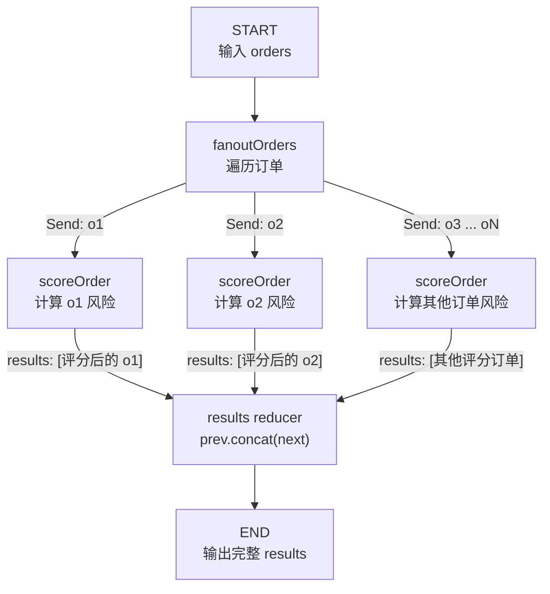

# LangGraph MapReduce 示例

本项目包含两个示例：

- `index.ts`：把字符串并发转换为大写。
- `index2.ts`：并发计算多笔订单的风险评分。

## 字符串示例

使用 `Send` 将数组元素动态分发给多个 mapper，转换成大写后由 reducer 汇总。

```bash
pnpm install
pnpm typecheck
pnpm start
```

输出：

```text
[ 'ABC', 'DBCD', 'ESDS' ]
```

流程：

```text
START -> Send(toUpper) x N -> collectResults -> END
```

## 订单风控示例

订单只保留三个与示例直接相关的字段：

```ts
{
    id: string,       // 订单标识
    amount: number,   // 用来判断风险
    isRisk?: boolean  // 判断完成后生成
}
```

运行：

```bash
node index2.ts
```

### 完整流程图



### reducer 是什么

`scoreOrder` 是并发执行的。每个任务都会返回同一个状态字段：

```ts
return {
    results: [{
        ...state.order,
        isRisk: state.order.amount >= 700
    }]
}
```

LangGraph 需要知道如何把这些更新写入共享状态。这里的 reducer 是：

```ts
fn: (prev, next) => prev.concat(next)
```

- `prev` 是已经收集到的结果。
- `next` 是某次 `scoreOrder` 新返回的结果。
- reducer 的返回值会成为下一次合并时的 `prev`。

以三笔订单为例，合并过程可以理解为：

```text
初始值：                       []
收到 o1：[]       + [o1结果] = [o1结果]
收到 o2：[o1结果] + [o2结果] = [o1结果, o2结果]
收到 o3：[o1结果, o2结果] + [o3结果]
                               = [o1结果, o2结果, o3结果]
```

因此，这里的 reducer 不是生成统计摘要，而是避免并发写入冲突，并把每个 Map 任务的结果收集到同一个数组中。`default: () => []` 表示合并从空数组开始，所以输入时无需提供 `results`。

整个过程可概括为：

```text
orders（一个数组）
    ↓ Send 扇出
多个 scoreOrder（每个处理一笔订单）
    ↓ reducer 合并
results（评分后的订单数组）
```

### 为什么必须保留 orders

`orders` 不是用于保证唯一性，而是本次 MapReduce 的批量输入。图刚开始执行时还没有任何 `scoreOrder` 任务，只有调用者传入的一组订单：

```ts
graph.invoke({
    orders: [o1, o2, o3]
})
```

LangGraph 根据状态 Schema 将它保存为：

```ts
state = {
    orders: [o1, o2, o3],
    results: []
}
```

接下来 `fanoutOrders` 必须从某个地方读取这批订单：

```ts
const fanoutOrders = (state) => {
    return state.orders.map(
        order => new Send("scoreOrder", { order })
    )
}
```

因此 `orders` 在三个阶段承担不同于 `results` 的职责：

```text
阶段 1：orders 接收批量输入
        [o1, o2, o3]

阶段 2：fanoutOrders 读取 orders 并拆分
        o1 → Send(scoreOrder)
        o2 → Send(scoreOrder)
        o3 → Send(scoreOrder)

阶段 3：scoreOrder 的返回值写入 results
        [判断后的 o1, 判断后的 o2, 判断后的 o3]
```

如果删除 `orders`，`fanoutOrders` 就没有待遍历的数据，无法知道应该创建多少个 `Send`。只有改变调用方式时才能删除它：例如每次 `invoke` 只传一笔订单。那样也会同时失去批量扇出和 reducer，不再是这个 MapReduce 示例。

`orders` 和 `results` 必须分开还有一个原因：`orders` 已经包含全部输入，如果让评分节点继续把结果合并回 `orders`，原始订单和评分订单会同时存在，产生重复数据。

```text
orders  = [o1, o2, o3]              // 只读输入
results = [o1判断结果, o2判断结果...] // 并发输出
```

### 三个常见的全局状态字段

LangGraph 的全局状态没有固定字段，应该根据业务设计。下面是三个常见例子：

| 字段 | 示例 | 用途 | 常见更新方式 |
|---|---|---|---|
| `tenantId` | `"company-01"` | 表示当前请求属于哪个企业，所有节点都可以读取 | 通常只在输入时设置，后续不更新 |
| `errors` | `[{ node: "scoreOrder", message: "超时" }]` | 收集多个并发节点产生的错误 | 使用数组 reducer 追加 |
| `processedCount` | `5` | 记录已经完成的订单数量 | 使用数字 reducer 累加 |

近似的 Schema 写法：

```ts
const BusinessState = z.object({
    // 请求上下文：所有节点读取
    tenantId: z.string(),

    // 并发错误：每个节点都可能写入，所以需要合并
    errors: z.array(z.string()).register(registry, {
        reducer: {
            fn: (prev, next) => prev.concat(next)
        },
        default: () => []
    }),

    // 完成数量：每个节点返回 1，reducer 负责相加
    processedCount: z.number().register(registry, {
        reducer: {
            fn: (prev, next) => prev + next
        },
        default: () => 0
    })
})
```

选择 reducer 的原则是：如果多个并发节点可能更新同一个字段，就必须明确这些更新应该怎样合并；只读取或只由单个节点写入的字段通常不需要 reducer。
